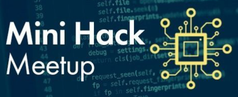
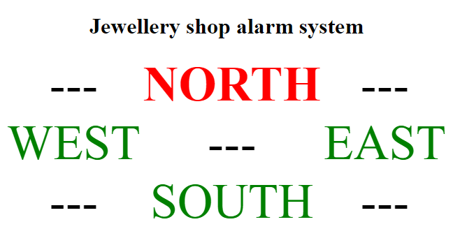
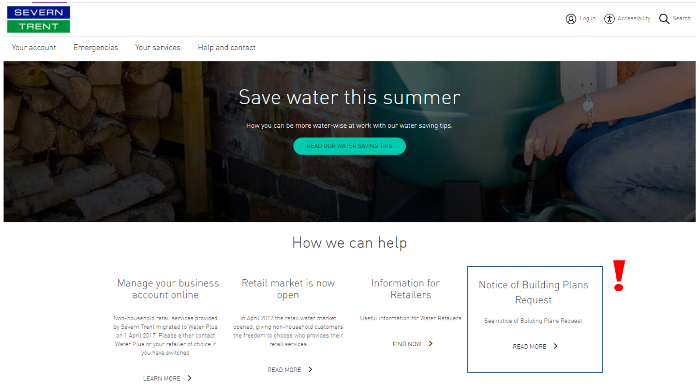
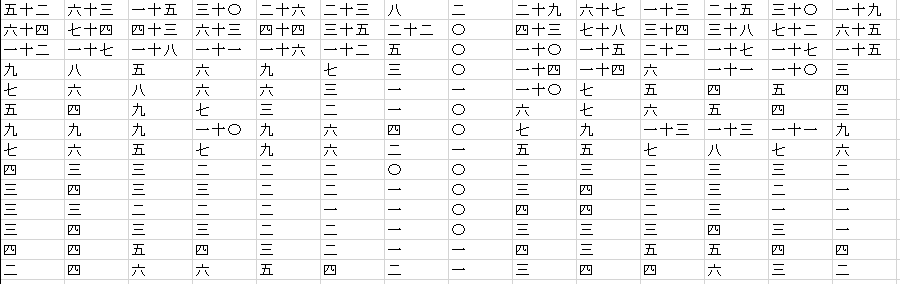
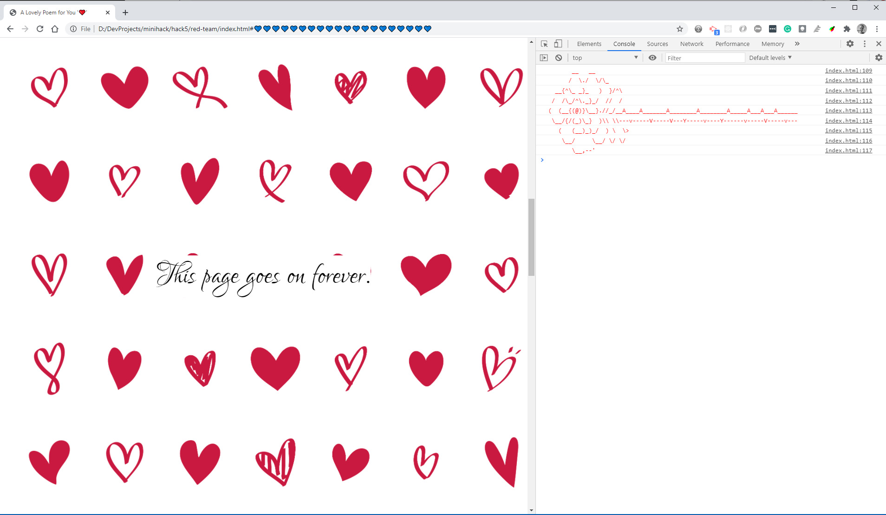

# Mini Hack

<em><a href="https://github.com/OnlineMiniHack/minihack">Mini Hack</a> is a monthly meetup where teams of between 3 and 6 people compete to produce the best solution to a given problem.</em>

I have participated in <b>12</b> Mini Hack events to date. See below for details of what I worked on each week. Apologies that I couldn't remember the names of everyone I worked with - if I worked with you but you are not mentioned below please get in touch and I will add you to the description!

I was <a href="img/certificate.png">winner</a> of the first six month league.

<table style="width:100%; text-align:center; border:none; table-layout: fixed">
  <colgroup>
    <col style="max-width:15%">
    <col style="max-width:25%">
    <col style="max-width:15%">
    <col style="max-width:30%">
    <col style="max-width:5%">
  </colgroup>  
  <tbody>

  <tr>
    <th width="15%" style="width:33%; text-align:center">Event</th>
    <th width="25%" style="width:33%; text-align:center">Image</th>
    <th width="15%" style="width:33%; text-align:center">Task</th>
    <th width="30%" style="width:33%; text-align:center">Info</th>
    <th width="5%" style="width:33%; text-align:center">Links</th>
  </tr>

  <!-- Mini Hack 14 -->
  <tr>
    <td align="center" width="15%" style="width:33%; text-align:center">Mini Hack 14 20 Dec 2021</td>
    <td align="center" width="25%" style="width:33%; text-align:center"></img></td>
    <td align="center" width="15%" style="width:33%; text-align:center"><em>display as many words as you can that rhyme in 30 seconds</em></td>
    <td align="center" width="30%" style="width:33%; text-align:center">Worked with <a href="https://github.com/pgillett">Peter Gillett</a> to find the highest-scoring group of rhyming words from the cmudict corpus using Python and display them on the screen using HTML, JavaScript and CSS.</td>
    <td align="center" width="5%" style="width:33%; text-align:center"></td>
  </tr>

  <!-- Mini Hack 13 -->
  <tr>
    <td align="center" width="15%" style="width:33%; text-align:center">Mini Hack 13 16 Nov 2021</td>
    <td align="center" width="25%" style="width:33%; text-align:center"></a></td>
    <td align="center" width="15%" style="width:33%; text-align:center"><em>create a system to replaces a jewellery shop alarm system</em></td>
    <td align="center" width="30%" style="width:33%; text-align:center">Worked with my team to develop a voice-controlled alarm system with a login vulnerability using HTML and JavaScript.</td>
    <td align="center" width="5%" style="width:33%; text-align:center"></td>
  </tr>

  <!-- Mini Hack 12 -->
  <tr>
    <td align="center" width="15%" style="width:33%; text-align:center"><a href="https://github.com/OnlineMiniHack/minihack/blob/master/hack12/hack12.md">Mini Hack 12</a> 12 Oct 2021</td>
    <td align="center" width="25%" style="width:33%; text-align:center"><a href="https://github.com/OnlineMiniHack/minihack/tree/master/hack12/red_team"></img></a></td>
    <td align="center" width="15%" style="width:33%; text-align:center"><em>convince a jewelery shop planning department that their plans have been taken by the water board and not stolen</em></td>
    <td align="center" width="30%" style="width:33%; text-align:center">Worked as part of the Red Team to create a fake recording of plans being retreived from a database and a hidden Google Chrome extension that changes the content of the BBC and Severn Trent water websites using HTML and JavaScript.</td>
    <td align="center" width="5%" style="width:33%; text-align:center"><a href="https://github.com/OnlineMiniHack/minihack/tree/master/hack12/red_team">code</a></td>
  </tr>

  <!-- Mini Hack 11 -->
  <tr>
    <td align="center" width="15%" style="width:33%; text-align:center"><a href="https://github.com/OnlineMiniHack/minihack/blob/master/hack11/hack11.md">Mini Hack 11</a> 14 Sep 2021</td>
    <td align="center" width="25%" style="width:33%; text-align:center"><a href="https://github.com/OnlineMiniHack/minihack/tree/master/hack11/yellow%20team"></img></a></td>
    <td align="center" width="15%" style="width:33%; text-align:center"><em>capture a sound without recording the sound itself as a sound file</em></td>
    <td align="center" width="30%" style="width:33%; text-align:center">Worked as part of the Yellow Team to convert a clip from Limp Bizkit's "Take a Look Around" into a table of Japanese numbers using Python.</td>
    <td align="center" width="5%" style="width:33%; text-align:center"><a href="https://github.com/OnlineMiniHack/minihack/tree/master/hack11/yellow%20team">code</a></td>
  </tr>

  <!-- Mini Hack 10 -->
  <tr>
    <td align="center" width="15%" style="width:33%; text-align:center"><a href="https://github.com/OnlineMiniHack/minihack/blob/master/hack10/hack10.md">Mini Hack 10</a> 4 Aug 2021</td>
    <td align="center" width="25%" style="width:33%; text-align:center"><a href="https://github.com/OnlineMiniHack/minihack/tree/master/hack10/orange_team"></img></a></td>
    <td align="center" width="15%" style="width:33%; text-align:center"><em>tell an interactive story</em></td>
    <td align="center" width="30%" style="width:33%; text-align:center">Worked with Petar Dimov on the Orange Team to tell the story of Mini Hack using <a href="https://twinery.org/">Twinery</a>.</td>
    <td align="center" width="5%" style="width:33%; text-align:center"><a href="https://github.com/OnlineMiniHack/minihack/tree/master/hack10/orange_team">code</a></td>
  </tr>

  <!-- Mini Hack 9 -->
  <tr>
    <td align="center" width="15%" style="width:33%; text-align:center"><a href="https://github.com/OnlineMiniHack/minihack/blob/master/hack9/hack9.md">Mini Hack 9</a> 22 Jun 2021</td>
    <td align="center" width="25%" style="width:33%; text-align:center"><a href="https://github.com/OnlineMiniHack/minihack/tree/master/hack9/red-team"></img></a></td>
    <td align="center" width="15%" style="width:33%; text-align:center"><em>create a secured application with a series of "back doors"</em></td>
    <td align="center" width="30%" style="width:33%; text-align:center">Worked as part of the Red Team to develop a password login page that allows access when the user says "my voice is my password", following by a facial recognition check that allows access if the user is holding a banana (or does it...?) using HTML and JavaScript.</td>
    <td align="center" width="5%" style="width:33%; text-align:center"><a href="https://github.com/OnlineMiniHack/minihack/tree/master/hack9/red-team">code</a></td>
  </tr>

  <!-- Mini Hack 8 -->
  <tr>
    <td align="center" width="15%" style="width:33%; text-align:center"><a href="https://github.com/OnlineMiniHack/minihack/blob/master/hack8/hack8.md">Mini Hack 8</a> 25 May 2021</td>
    <td align="center" width="25%" style="width:33%; text-align:center"><a href="https://github.com/OnlineMiniHack/minihack/tree/master/hack8/green_team"></img></a></td>
    <td align="center" width="15%" style="width:33%; text-align:center"><em>create a system that manages train schedules</em></td>
    <td align="center" width="30%" style="width:33%; text-align:center">Worked as part of the Green Team to put together a browser-based game where players have to remove leaves from in front of a moving train using HTML and JavaScript.
    <td align="center" width="5%" style="width:33%; text-align:center"><a href="https://github.com/OnlineMiniHack/minihack/tree/master/hack8/green_team">code</a></td>
  </tr>

  <!-- Mini Hack 6 -->
  <tr>
    <td align="center" width="15%" style="width:33%; text-align:center"><a href="https://github.com/OnlineMiniHack/minihack/blob/master/hack6/hack6.md">Mini Hack 6</a> 23 Mar 2021</td>
    <td align="center" width="25%" style="width:33%; text-align:center"><a href="https://easter-egg-hunt.netlify.app/"></img></a></td>
    <td align="center" width="15%" style="width:33%; text-align:center"><em>create an "Easter Egg" hunt</em></td>
    <td align="center" width="30%" style="width:33%; text-align:center">Worked as part of the Yellow Team to create a website about Easter packed with tons of Easter Eggs using HTML and JavaScript.
    <td align="center" width="5%" style="width:33%; text-align:center"><a href="https://easter-egg-hunt.netlify.app/">site</a>  <a href="https://github.com/OnlineMiniHack/minihack/tree/master/hack6/yellow_team">code</a></td>
  </tr>

  <!-- Mini Hack 5 -->
  <tr>
    <td align="center" width="15%" style="width:33%; text-align:center"><a href="https://github.com/OnlineMiniHack/minihack/blob/master/hack5/hack5.md">Mini Hack 5</a> 23 Feb 2021</td>
    <td align="center" width="25%" style="width:33%; text-align:center"><a href="https://github.com/OnlineMiniHack/minihack/tree/master/hack5/red-team"></img></a></td>
    <td align="center" width="15%" style="width:33%; text-align:center"><em>create a virtual valentines card or gift</em></td>
    <td align="center" width="30%" style="width:33%; text-align:center">Worked with <a href="https://github.com/blueboxes">John Kilmister</a> and Andrew on the Red Team to create a web based love poem with audio, URL animation and console images using HTML and JavaScript.</td>
    <td align="center" width="5%" style="width:33%; text-align:center"><a href="https://github.com/OnlineMiniHack/minihack/tree/master/hack5/red-team">code</a></td>
  </tr>

  <!-- Mini Hack 4 -->
  <tr>
    <td align="center" width="15%" style="width:33%; text-align:center"><a href="https://github.com/OnlineMiniHack/minihack/blob/master/hack4/hack4.md">Mini Hack 4</a> 19 Jan 2021</td>
    <td align="center" width="25%" style="width:33%; text-align:center"><a href="https://youtu.be/W0FYjyfM_fI"></img></a></td>
    <td align="center" width="15%" style="width:33%; text-align:center"><em>break a high value asset out of prison</em></td>
    <td align="center" width="30%" style="width:33%; text-align:center">Worked as part of the Green Team to program a micro:bit to play "Happy Birthday" and display a cryptic message using <a href="https://makecode.microbit.org/">MakeCode</a> and JavaScript.</td>
    <td align="center" width="5%" style="width:33%; text-align:center"><a href="https://youtu.be/W0FYjyfM_fI">YouTube</a>  <a href="https://github.com/OnlineMiniHack/minihack/tree/master/hack4/greenteam">code</a></td>
  </tr>

  <!-- Mini Hack 3 -->
  <tr>
    <td align="center" width="15%" style="width:33%; text-align:center"><a href="https://github.com/OnlineMiniHack/minihack/blob/master/hack3/red/hack3.md">Mini Hack 3</a> 21 Dec 2021</td>
    <td align="center" width="25%" style="width:33%; text-align:center"><a href="https://github.com/OnlineMiniHack/minihack/tree/master/hack3/red"></img></a></td>
    <td align="center" width="15%" style="width:33%; text-align:center"><em>build something that counts the days until Christmas</em></td>
    <td align="center" width="30%" style="width:33%; text-align:center">Worked with <a href="https://github.com/GeorgeWL">George W Langham</a> on the Red Team to make an "on this day" advent webpage that didn't quite get finished on time using Python, HTML, and JavaScript.</td>
    <td align="center" width="5%" style="width:33%; text-align:center"><a href="https://github.com/OnlineMiniHack/minihack/tree/master/hack3/red">code</a></td>
  </tr>

  <!-- Mini Hack 2 -->
  <tr>
    <td align="center" width="15%" style="width:33%; text-align:center"><a href="https://github.com/OnlineMiniHack/minihack/blob/master/hack2/hack2.md">Mini Hack 2</a> 23 Nov 2021</td>
    <td align="center" width="25%" style="width:33%; text-align:center"><a href="https://memory-game-mini-hack.netlify.app/"></img></a></td>
    <td align="center" width="15%" style="width:33%; text-align:center"><em>create a game with no graphics</em></td>
    <td align="center" width="30%" style="width:33%; text-align:center">Worked with <a href="https://github.com/J-R-Oliver">James Oliver</a> on the Blue Team to create a browser-based game where players have to remember a list of fruit names spoken to them by the speechSynthesis API using HTML and JavaScript.</td>
    <td align="center" width="5%" style="width:33%; text-align:center"><a href="https://memory-game-mini-hack.netlify.app/">app</a>  <a href="https://github.com/OnlineMiniHack/minihack/tree/master/hack2/blue">code</a></td>
  </tr>
  </tbody>
</table>
